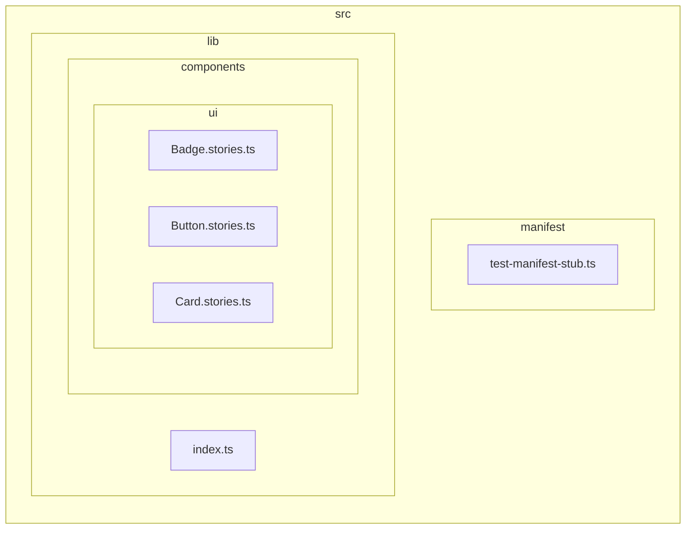

```mermaid
flowchart LR

subgraph 0["src"]
subgraph 1["lib"]
subgraph 2["components"]
subgraph 3["ui"]
4["Badge.stories.ts"]
5["Button.stories.ts"]
6["Card.stories.ts"]
end
end
7["index.ts"]
end
subgraph 8["manifest"]
9["test-manifest-stub.ts"]
end
end

```
